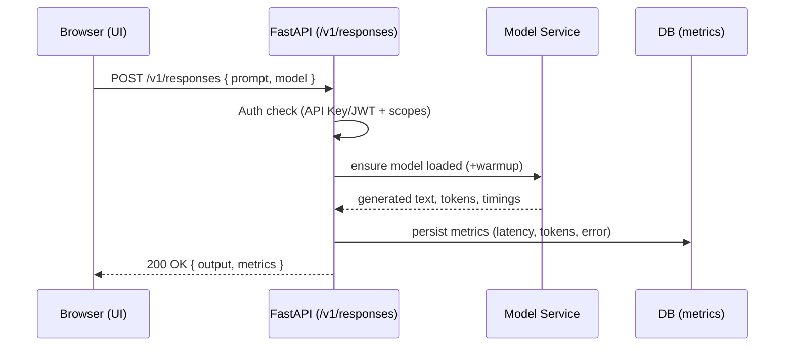

# ARCHITECTURE — LLMPlayBench

## System Overview

```mermaid
flowchart LR
  subgraph Browser[Browser]
    UI[React + Vite + MUI]
  end

  subgraph Frontend[frontend / frontend-dev]
    Vite[Vite Dev Server (dev)]
    Nginx[Nginx (prod)]
  end

  subgraph Backend[FastAPI Backend]
    API[FastAPI API /v1/*]
    Services[Services: model, metrics, benchmark]
    Auth[Auth: API Key & JWT]
    Logging[Loguru]
  end

  subgraph Data[Persistence]
    DB[(Postgres / SQLite)]
    Cache[(Redis) optional]
    ModelsDir[(./models cache)]
  end

  UI <-- HMR / static --> Vite
  UI <-- static --> Nginx
  UI -->|HTTP JSON| API
  API --> Services
  Services --> DB
  Services --> Cache
  Services --> ModelsDir
```

## Request Flow (Responses API)



## Components

- Frontend: React + Vite + MUI; dev via Vite HMR, prod via Nginx.
- Backend: FastAPI with routers; services for models, metrics, benchmarks.
- Auth: API Key + JWT with read/write/admin scopes.
- Metrics: SQLAlchemy models in Postgres/SQLite; future Prometheus exporter.
- Logging: Loguru with rotation/retention/compression.

## Deployment

- docker-compose profiles:
  - dev: backend + frontend-dev + Postgres + pgAdmin
  - prod: backend + frontend (Nginx) + Postgres + pgAdmin
