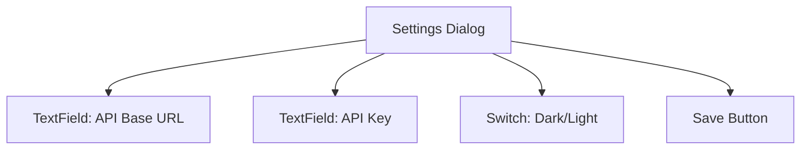

# WIREFRAMES — LLMPlayBench

These wireframes use Mermaid to illustrate structure; actual UI uses MUI components.

## Dashboard

```mermaid
flowchart TB
  AppBar[Top AppBar: title + theme toggle + settings]
  Grid[Main Grid]
  Card1[Card: Summary Stats]
  Card2[Card: Latency Over Time (empty state / skeleton)]
  Card3[Card: Tokens/sec (empty state / skeleton)]
  Table[Card: Recent Requests Table]

  AppBar --> Grid
  Grid --> Card1
  Grid --> Card2
  Grid --> Card3
  Grid --> Table
```

## Playground

```mermaid
flowchart TB
  AppBar[Top AppBar: title + theme toggle + settings]
  Layout[Container]
  Model[Card: Model Selector]
  Params[Card: Parameters (temperature, max/min tokens)]
  Prompt[Card: Prompt Input]
  Actions[Run/Stop Buttons]
  Output[Card: Model Output]

  AppBar --> Layout
  Layout --> Model
  Layout --> Params
  Layout --> Prompt
  Layout --> Actions
  Layout --> Output
```

## Settings Dialog


